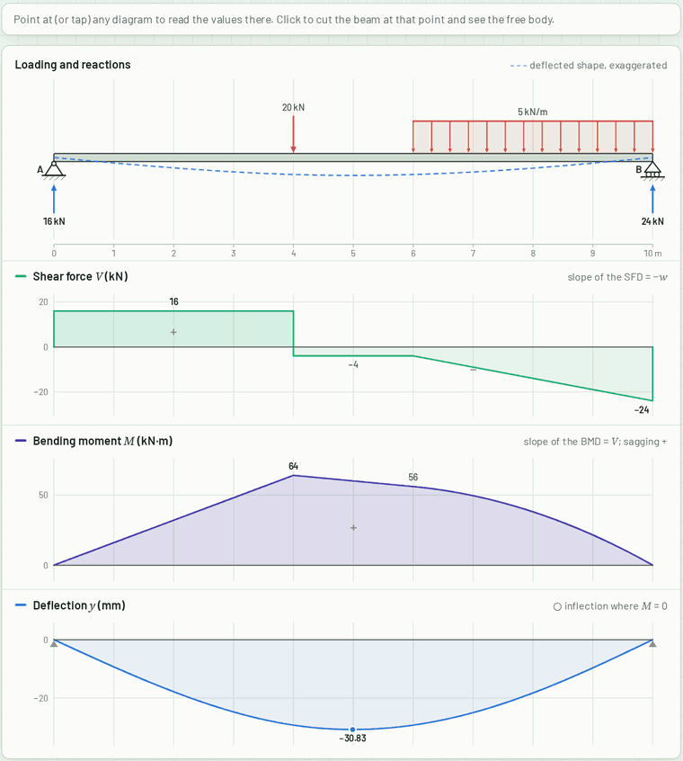
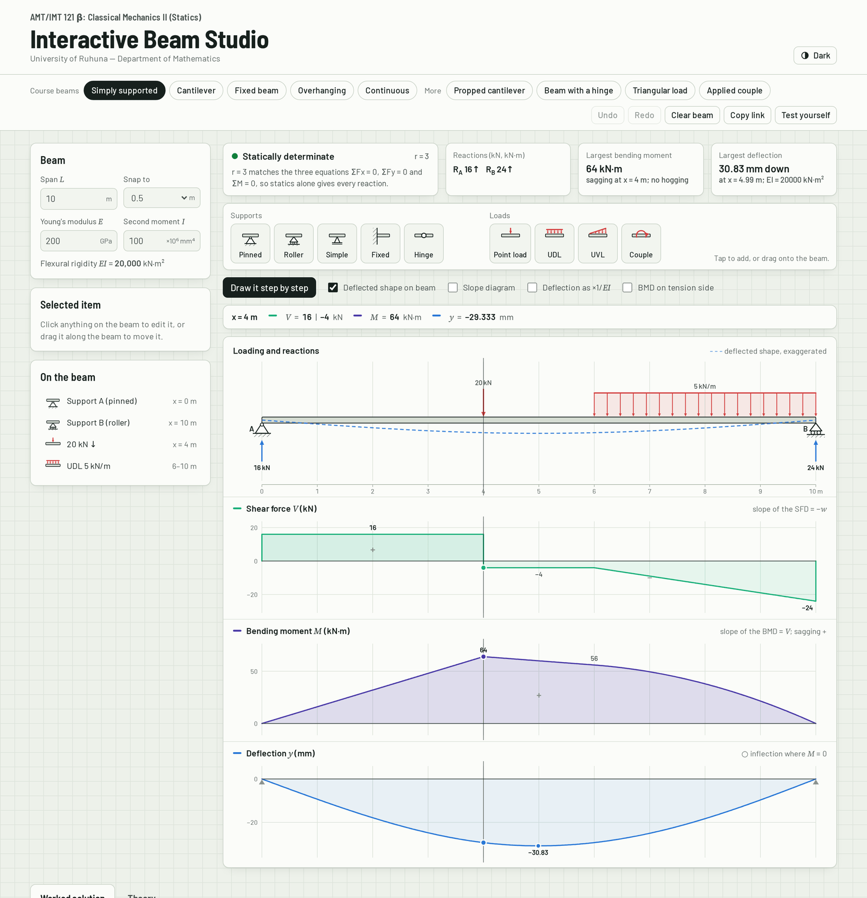
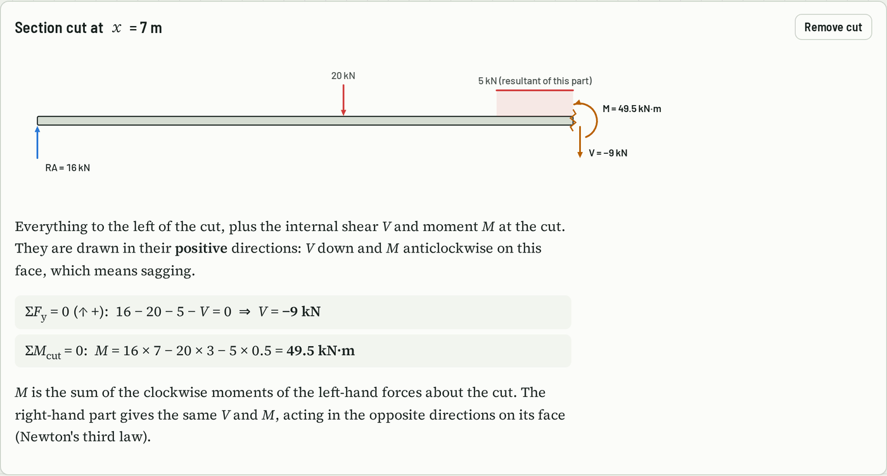
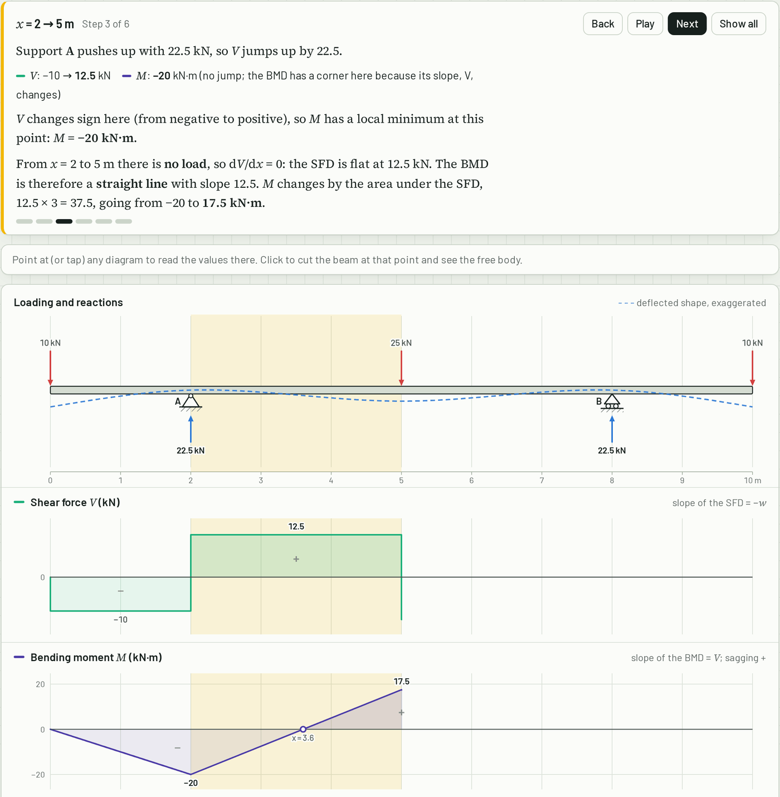
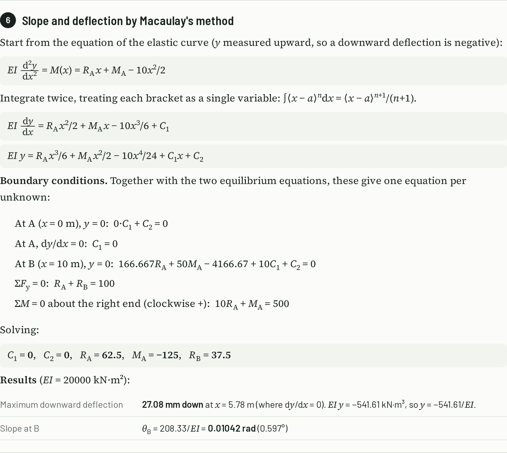
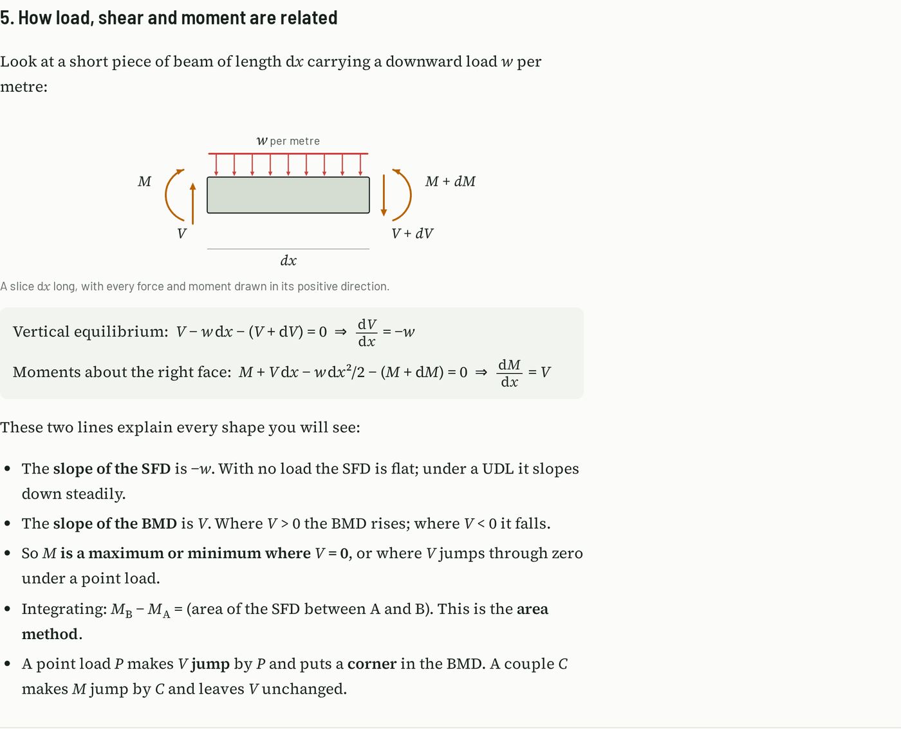
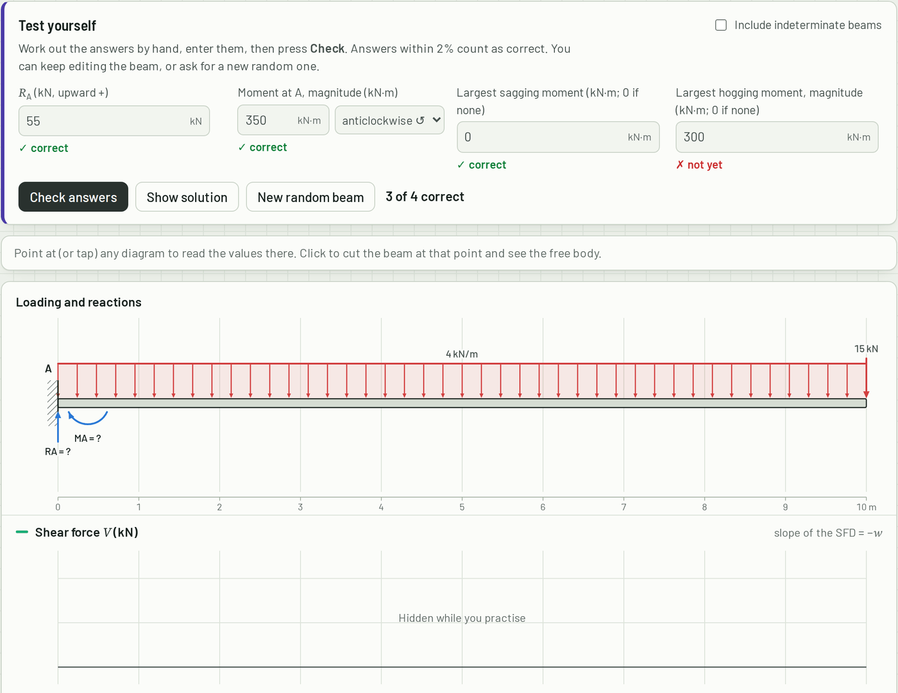
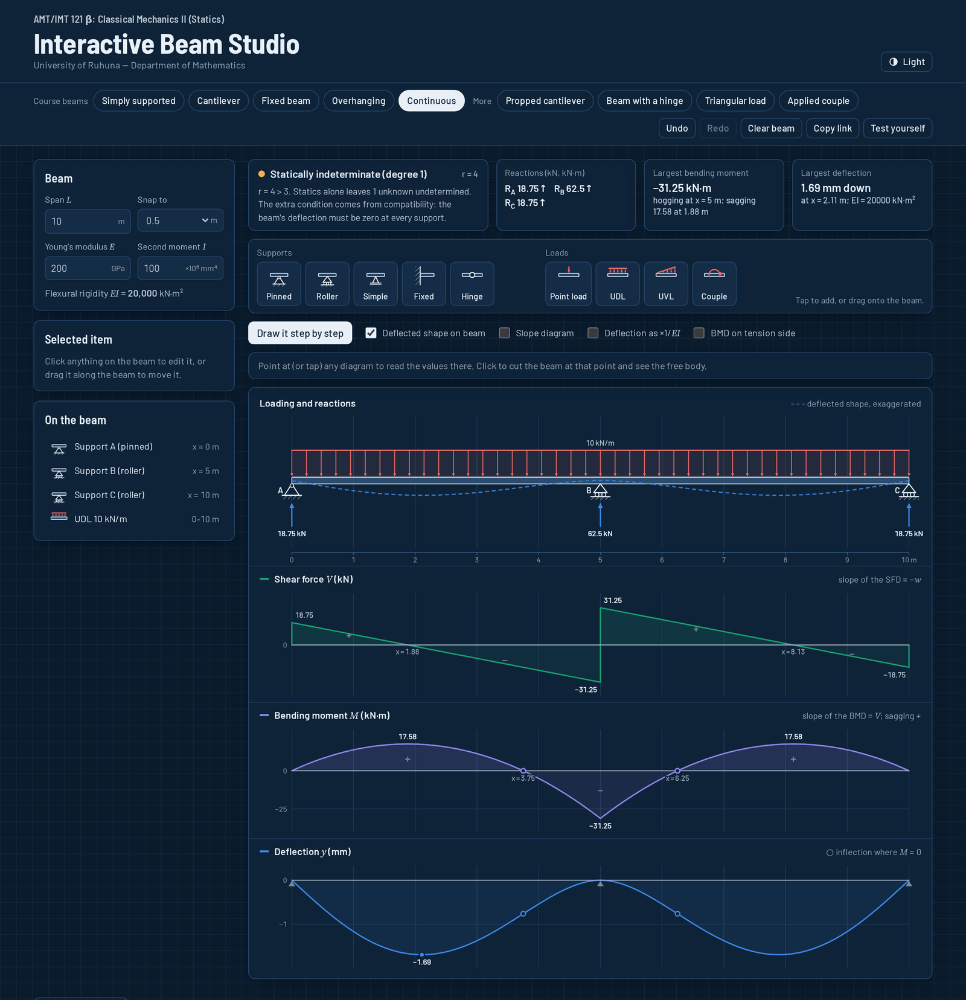
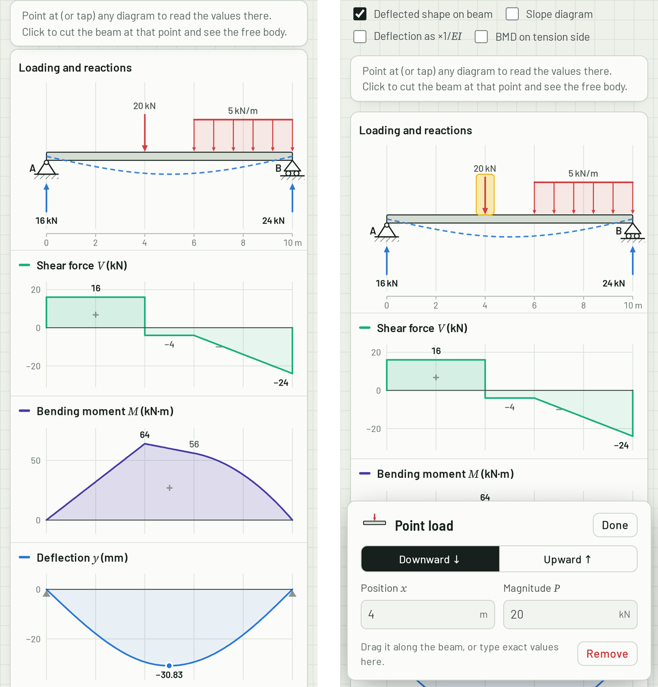

# Interactive Beam Studio

Build any beam, then study its reactions, shear force diagram, bending moment diagram and deflection, with a complete worked solution for every beam you build.

**[Open the tool online](https://vihini2004.github.io/Beam-Studio/#b=eyJMIjoxMCwiRSI6MjAwLCJJIjoxMDAsInMiOltbInAiLDBdLFsiciIsMTBdXSwiaCI6W10sImwiOltbInAiLDQsMjBdLFsiZCIsNiwxMCw1LDVdXX0)**, or download [`index.html`](index.html) and open it in any browser. It works offline.



Built as a learning tool for **AMT/IMT 121 β: Classical Mechanics II (Statics)**, Department of Mathematics, University of Ruhuna.

## What it does

### Build any beam

- **Supports:** pinned, roller, simple (knife edge) and fixed, placed anywhere along the span.
- **Internal hinges**, for compound (Gerber) beams.
- **Loads:** point loads (up or down), uniformly distributed loads (UDL), uniformly varying loads (triangular or trapezoidal) and applied couples.
- Drag anything along the beam, tap a tool to add it, or type exact values. Undo and redo are built in.
- Span, Young's modulus *E* and second moment of area *I* can be changed; the flexural rigidity *EI* is shown in kN·m².

### See every result, lined up

- Loading and reactions, shear force, bending moment, slope (optional) and deflection are drawn on **one shared x-axis**, so a vertical line through the page is the same section in every diagram.
- Peak values, points of zero shear and points of contraflexure are labelled on the diagrams.
- The deflected shape is drawn on the beam itself, exaggerated so it is visible.
- Point at (or tap) any diagram to read *V*, *M* and *y* at that section (and *θ* when the slope diagram is on).

### Learn how the diagrams are made

- **Section cut:** click any diagram to cut the beam there. The free-body diagram of the left-hand part appears, with ΣF<sub>y</sub> = 0 and ΣM = 0 written out in numbers.
- **Draw it step by step:** walks along the beam from left to right. It explains every jump (point loads, couples, reactions), every slope (dV/dx = −w, dM/dx = V) and the area rule, revealing the diagrams as it goes.
- **Worked solution:** generated for whatever beam is on screen. It covers determinacy, load resultants, reactions (by statics, or by compatibility for indeterminate beams), *V(x)* and *M(x)* as Macaulay expressions and segment by segment, key values, slope and deflection by Macaulay's method with every boundary condition and constant, and final equilibrium checks.
- **Theory:** supports and boundary conditions, determinacy and stability, equivalent loads, sign conventions, the load–shear–moment relations, drawing SFD and BMD by hand, the elastic curve, Macaulay's method, and a table of standard results that load straight into the studio.
- **Test yourself:** hides the answers so students can work out the reactions and peak moments by hand, then checks them (within 2%). It can generate random problems, optionally including indeterminate beams.

### Share and teach

- **Copy link** stores the exact beam in the URL. Turn on *Test yourself* first to share it as an exercise with the answers hidden.
- Light and dark themes, works on phones, and prints cleanly (diagrams followed by the worked solution).

## Screenshots

<table>
  <tr>
    <td width="50%"><br><b>The whole studio</b>: tools, key results and the aligned diagrams.</td>
    <td width="50%"><br><b>Section cut</b>: the free body at any section, with ΣF<sub>y</sub> and ΣM worked out.</td>
  </tr>
  <tr>
    <td width="50%"><br><b>Draw it step by step</b>: each jump and slope explained, one stretch at a time.</td>
    <td width="50%"><br><b>Worked solution</b>: Macaulay's method, including indeterminate beams.</td>
  </tr>
  <tr>
    <td width="50%"><br><b>Theory</b>: why each diagram has the shape it has.</td>
    <td width="50%"><br><b>Test yourself</b>: answers checked, diagrams hidden until you are ready.</td>
  </tr>
  <tr>
    <td width="50%"><br><b>Dark mode</b>: a two-span continuous beam.</td>
    <td width="50%"><br><b>On a phone</b>: tap to add, drag to move, edit in a bottom sheet.</td>
  </tr>
</table>

## How to use it

**Online:** open <https://vihini2004.github.io/Beam-Studio/>.

**Offline:** download [`index.html`](index.html) and double-click it. The code and fonts are all inside that one file, so it needs no internet connection, installation or account. It can be shared on a USB stick or through a course page.

**Quick start:**

1. Pick a beam from the preset row, or press **Clear beam** and build your own from the tool strip.
2. Click anything on the beam to edit it, or drag it to move it.
3. Point at a diagram to read values; click to cut a section.
4. Press **Draw it step by step** to see how the diagrams are built, and open **Worked solution** for the full working.

## How it calculates

The solver uses **Macaulay's method** (singularity functions), which gives exact piecewise-polynomial shear force, bending moment, slope and deflection for any combination of supports and loads.

Taking the origin at the left end, every force to the left of a section contributes a bracket term to the bending moment. The bracket $\langle x-a \rangle^n$ is zero while $x < a$:

$$
EI\frac{d^2y}{dx^2} = M(x) = \sum_i R_i\langle x-s_i\rangle + \sum_j M_j\langle x-s_j\rangle^0 - \sum_k P_k\langle x-a_k\rangle + \sum_m C_m\langle x-c_m\rangle^0 - \text{(distributed-load terms)}
$$

Integrating twice adds two constants, $C_1$ and $C_2$, plus one slope jump at each internal hinge. The unknowns (vertical reactions, fixed-end moments, $C_1$, $C_2$ and the hinge slope jumps) are then found together from one square linear system:

| Condition | Where it applies |
| --- | --- |
| $\sum F_y = 0$ and $\sum M = 0$ | the whole beam |
| $M = 0$ | at every internal hinge |
| $y = 0$ | at every support |
| $dy/dx = 0$ | at every fixed support |

The system always has as many equations as unknowns. That lets the same method handle statically determinate **and** indeterminate beams (propped cantilevers, fixed–fixed beams, continuous beams). If the system is singular, the beam is a mechanism, and the studio says so and explains why. Determinacy is also classified by counting: *r* reaction components against 3 + *c* equations for *c* hinges, with the improper case where every reaction is parallel (rollers only) reported separately.

Because each segment is an exact polynomial, peak moments, points of zero shear, points of contraflexure and maximum deflections are located exactly. They are not read off a sampled curve.

## Verification

Every change is checked by the test suite (`npm test`, about 4 seconds):

- **83 textbook benchmarks.** Closed-form reactions, moments and deflections for the course presets and standard cases. Some examples:

  | Beam | Checked against |
  | --- | --- |
  | Cantilever, UDL + end load | $M_A = -350$ kN·m, tip deflection $PL^3/3EI + wL^4/8EI$ |
  | Fixed–fixed, central load | $M = \pm PL/8$, $\delta = PL^3/192EI$ |
  | Two-span continuous, UDL | $R = 3wl/8,\ 10wl/8,\ 3wl/8$, $M_B = -wl^2/8$ |
  | Propped cantilever, UDL | $9wL^2/128$ at $5L/8$, $\delta_{max} \approx wL^4/185EI$ |
  | Triangular load, simply supported | $wL^2/9\sqrt{3}$ at $L/\sqrt{3}$ |
  | Beam with an internal hinge | $M = 0$ at the hinge, reactions by statics |

- **4,000 random beams on every run**, with random supports, hinges and loads. Each solvable beam (about two-thirds of them) is compared with an **independent finite-element solver** (`test/fem.js`, Euler–Bernoulli beam elements). Reactions, fixed-end moments and deflections agree to within one part in a million. The identities $dM/dx = V$, $dV/dx = -w$ and $EI\,y'' = M$ are also checked on every segment. For every beam the solver calls unstable, the finite-element model is confirmed to be singular too.

## Sign conventions

| Quantity | Positive when |
| --- | --- |
| Position *x* | measured from the left end |
| Loads *P*, *w* | acting downward |
| Reactions *R* | acting upward |
| Couples *C* and reaction moments | clockwise |
| Shear force *V* | the resultant of the forces on the left part acts upward |
| Bending moment *M* | sagging, i.e. the moments of the left-hand forces about the section are clockwise |
| Deflection *y* | upward, so $EI\,y'' = M$ and a loaded beam has $y < 0$ |

Books that measure *y* downward write $EI\,y'' = -M$; the physics is the same. A switch draws the bending moment diagram on the tension side (sagging plotted downward) for courses that use that convention.

## Limitations

- Vertical loads only: there are no inclined or axial loads, so no axial force diagram.
- *EI* is constant along the beam.
- Small-deflection Euler–Bernoulli theory (shear deformation is ignored).
- No support settlement, spring supports or temperature effects.
- Units are fixed: kN, m, kN·m, kN/m and mm.

## Project structure

```
index.html          the complete tool, built from src/ (this is the file to share)
src/solver.js       the solver: Macaulay's method, determinacy, key values
src/draw.js         SVG drawing of the beam and all diagrams
src/explain.js      worked solution, step-by-step text and the section free body
src/app.js          the interface: editing, undo, practice mode, links
src/util.js         number formatting and maths typesetting helpers
src/styles.css      light and dark styles
src/template.html   page structure and the theory text
test/               solver tests and the finite-element reference solver
build.js            bundles src/ and the fonts into index.html
docs/images/        screenshots used in this README
```

## Development

You need [Node.js](https://nodejs.org/) 18 or later.

```bash
npm install     # fetches the fonts that the build embeds
npm run build   # writes index.html
npm test        # textbook benchmarks, then 4,000 random beams against the FEM solver
```

Edit the files in `src/`, then run `npm run build` and open `index.html`. The solver has no dependencies and also runs in Node:

```js
const { solve } = require('./src/solver.js');
const r = solve({
  L: 10, E: 200, I: 100,                                   // m, GPa, ×10⁶ mm⁴
  supports: [{ type: 'pinned', x: 0 }, { type: 'roller', x: 10 }],
  loads: [{ type: 'point', x: 4, P: 20 }, { type: 'dist', a: 6, b: 10, w1: 5, w2: 5 }],
});
console.log(r.supports.map(s => s.R));   // [16, 24]
console.log(r.extremes.Mmax);            // { x: 4, v: 64, ... }
```

In the browser console, `BeamStudio.result()` returns the solution for the beam on screen.

## Contributing

Issues and pull requests are welcome, especially from students and lecturers who use the tool. If an answer ever looks wrong, please open an issue with a **Copy link** URL of the beam so it can be reproduced exactly.

Ideas for future work:

- Inclined loads and an axial force diagram
- Beams with varying *EI*
- Support settlement and spring supports
- Influence lines
- Sinhala and Tamil translations

## Licence

The code is released under the [MIT Licence](LICENSE). The embedded fonts, Barlow and Source Serif 4, are used under the SIL Open Font License 1.1 (see [`licenses/`](licenses)).
